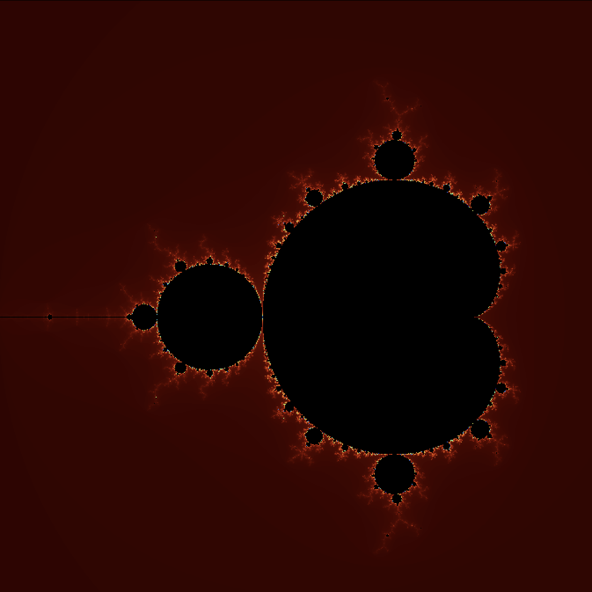

# Mandelbrot Fractal Documentation

## Overview

The **Mandelbrot set** is a complex mathematical fractal defined by the recurrence relation:
\[ z_{n+1} = z_n^2 + c \]
where \( c \) is a complex number and \( z_0 = 0 \). The set contains all \( c \) for which the sequence remains bounded.

## Key Properties

- **Self-similarity**: Infinite complexity at all scales.
- **Boundary**: Fractal dimension ≈ 2 (non-integer, indicating roughness).
- **Escape Radius**: If \( |z_n| > 2 \), the sequence diverges.

## Algorithm
1. **Map pixels** to the complex plane (e.g., \( x \in [-2.5, 1.5] \), \( y \in [-2, 2] \)).
2. **Iterate** \( z_{n+1} = z_n^2 + c \) for each \( c \).
3. **Color** pixels based on iteration count before divergence.


## Detailed visualization of Mandelbrot set fractal pattern
<div style="text-align: center; margin: 2rem auto; max-width: 800px">
  
  
  <p style="font-family: 'Georgia', serif; font-size: 0.95rem; color: #444; margin-top: 0.5rem">
    <b>Fig. 1:</b> High-iteration (k = 100) of Mandelbrot set boundary region<br>
  </p>
</div>

<div style="text-align: center; margin: 2rem auto; max-width: 800px">
  
  
  <p style="font-family: 'Georgia', serif; font-size: 0.95rem; color: #444; margin-top: 0.5rem">
    <b>Fig. 2:</b> High-iteration (k = 1000) of Mandelbrot set boundary region<br>
  </p>
</div>

<div style="text-align: center; margin: 2rem auto; max-width: 800px">
  
  
  <p style="font-family: 'Georgia', serif; font-size: 0.95rem; color: #444; margin-top: 0.5rem">
    <b>Fig. 3:</b> High-iteration (k = 1200) of Mandelbrot set boundary region<br>
  </p>
</div>


## Directory Structure

```text
.
├── assets/                # Pictures
│   └── pic.png            # Figures of fractal
├── legacy/                # 
│   └── mandelbrot_set.pas # Legacy PascalABC implementation
│
└── mandelbrot_set/        
    ├── src/               # Modern Rust implementation (primary)
        ├── main.rs        # Entry point and CLI interface
        └── my_draw.rs     # Drawing funcs exports
